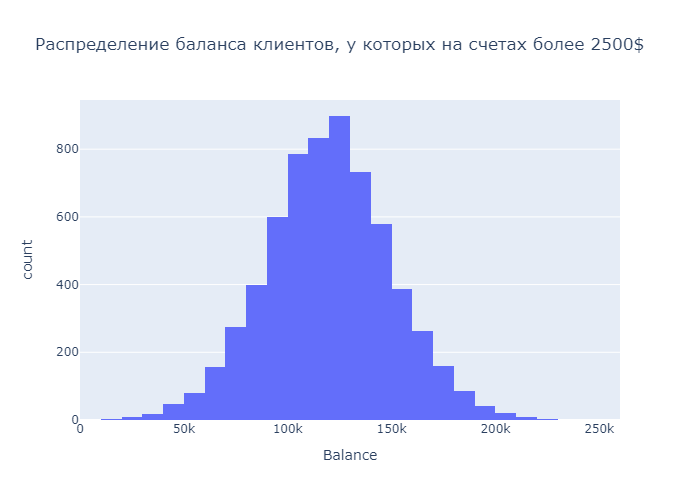
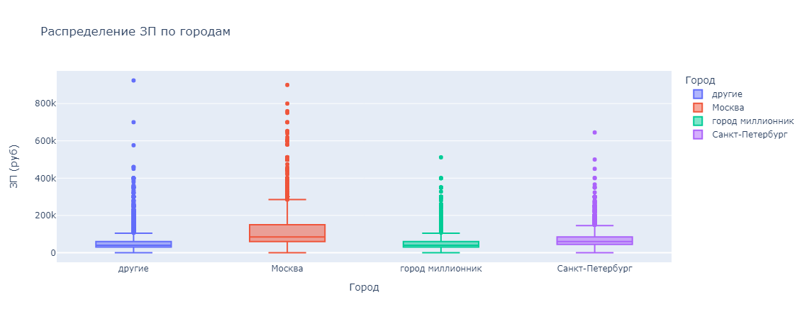
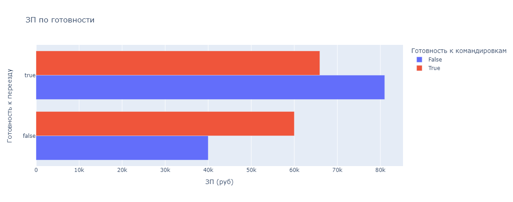
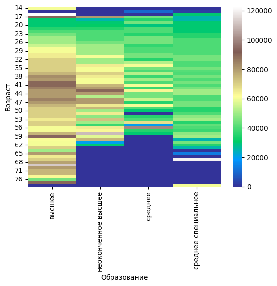
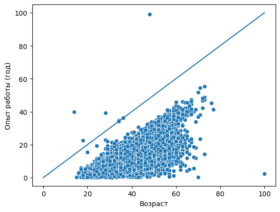
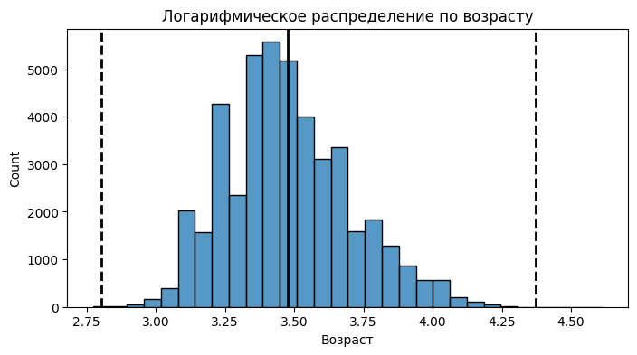

# *Визуализация данных: Задача банка*
## <center>**Оглавление**<center>
## [1. Задание 1](https://github.com/alexmoscar/new-rep/blob/main/data/visual_task/readme.md#Задание-1)
## [2. Задание 2](https://github.com/alexmoscar/new-rep/blob/main/data/visual_task/readme.md#Задание-2)
## [3. Задание 3](https://github.com/alexmoscar/new-rep/blob/main/data/visual_task/readme.md#Задание-3)
## [4. Задание 4](https://github.com/alexmoscar/new-rep/blob/main/data/visual_task/readme.md#Задание-4)
## [5. Задание 5](https://github.com/alexmoscar/new-rep/blob/main/data/visual_task/readme.md#Задание-5)
## [5. Задание 6](https://github.com/alexmoscar/new-rep/blob/main/data/visual_task/readme.md#Задание-6)
## [5. Задание 7](https://github.com/alexmoscar/new-rep/blob/main/data/visual_task/readme.md#Задание-7)
## [5. Задание 8](https://github.com/alexmoscar/new-rep/blob/main/data/visual_task/readme.md#Задание-8)
## [5. Задание 9](https://github.com/alexmoscar/new-rep/blob/main/data/visual_task/readme.md#Задание-9)<hr>
## <center>**Основная часть**<center>
## Задание 1 
### *Каково соотношение ушедших и лояльных клиентов? Покажите это на графике и дайте комментарий по соотношению.*
```python
import pandas as pd
import matplotlib.pyplot as plt
import seaborn as sns
import plotly
import plotly.express as px
churn_data = pd.read_csv('churn.csv')
left_clients = churn_data.groupby(['Exited'])['RowNumber'].count()
labels = ['Лояльные', 'Ушедшие']
plt.figure(figsize=(5,5))
plt.title('Соотношение числа лояльных и ушедших клиентов')
plt.pie(left_clients, explode = [0.1, 0], labels = labels, autopct='%.0f%%')
plt.show()
```

```python
bar_database = database.groupby('Образование', as_index = False)['ЗП (руб)'].median()
fig = px.bar(data_frame = bar_database, x = 'Образование', y = 'ЗП (руб)', color = 'Образование', title = 'ЗП медианное по Образованию')
fig.show()
```
*   **3.5.** Следующим этапом была построена диаграмма, которая показывает распределение желаемой заработной платы ("ЗП (руб)") в зависимости от города ("Город"). Использовалась коробчатая диаграмма. При этом, <ins>желаемая заработная плата меньше 1 млн рублей<ins>.

```python
box_database = database[database['ЗП (руб)']<1e6]
fig = px.box(data_frame = box_database, x = 'Город', y = 'ЗП (руб)', color = 'Город', title = 'Распределение ЗП по городам')
fig.show()
```
*   **3.6.** Далее строили многоуровневую столбчатую диаграмму, которая показывает зависимость медианной заработной платы от признаков "Готовность к переезду" и "Готовность к командировкам". Использована стобчатая диаграмма.

```python
bars_database = database.groupby(['Готовность к командировкам','Готовность к переезду'], as_index=False)['ЗП (руб)'].median()
fig = px.bar(data_frame= bars_database, y = 'Готовность к переезду', x = 'ЗП (руб)', barmode='group', color = 'Готовность к командировкам', title = 'ЗП по готовности')
fig.show()
```
*   **3.7.** Следующим этапом была построена сводная таблица, иллюстрирующая зависимость медианной желаемой заработной платы от возраста и образования. Для анализа, построена тепловая карта.

```python
pivot_data = database.pivot_table(values = 'ЗП (руб)', index = 'Возраст', columns = 'Образование', fill_value=0,
                                  aggfunc='median')
fig = sns.heatmap(data = pivot_data, cmap='terrain')
```
*  **3.8.** Итоговой была диаграмма рассеяния, показывающая зависимость опыта работы от возраста. Также была построена дополнительная прямая, которая соответствует значениям, когда опыт работы равен возрасту человека.

```python
database['Опыт работы (год)'] = database['Опыт работы (месяц)']/12
sns.lineplot(x = [0,100], y = [0,100])
fig = sns.scatterplot(data = database, x = 'Возраст' , y = 'Опыт работы (год)')
```
[К оглавлению](https://github.com/alexmoscar/new-rep/blob/main/data/project1/Readme.md#Оглавление)<hr>

## Очистка данных
## *В данном блоке была проведена работа по очистке данных от дубликатов, пропусков и вбросов*
*   **4.1.** Удаление дубликатов.
```python
#обращаемся к списку колонок в таблице
dupl_columns = list(database.columns)
# создаем маску для отслеживания дубликатов
mask = database.duplicated(subset=dupl_columns)
# теперь, по маске ищем дубликаты и выводим их к-во
hh_duplicates = database[mask]
print(f'Число найденных дубликатов: {hh_duplicates.shape[0]}')
# через drop.duplicates, удаляем дубликаты
database = database.drop_duplicates(subset=dupl_columns)
```
*   **4.2.** Вывод информации о наличии пропусков.
```python
#находим количество пропусков
data_null = database.isnull().sum()
#выводим те столбцы, где пропусков больше 0
print(data_null[data_null>0])
```
*   **4.3.** В предыдущем пункте обнаружили,что пропуски есть в "Опыт работы (месяц)", "Последнее/нынешнее место работы", "Последняя/нынешняя должность". Что сделано: Удалены строки, где есть пропуск в столбцах с местом работы и должностью. Пропуски в столбце с опытом работы заполнены медианным значением.
```python
database = database.dropna(subset = ['Последнее/нынешнее место работы','Последняя/нынешняя должность'])
database['Опыт работы (месяц)'] = database['Опыт работы (месяц)'].fillna(database['Опыт работы (месяц)'].median())
print(round(database['Опыт работы (месяц)'].mean()))
```
*   **4.4.** Удалены выбросы, путем удаления резюме, в которых указана заработная плата либо выше 1 млн. рублей, либо ниже 1 тыс. рублей.
```python
out = database[(database['ЗП (руб)']<1e3) | (database['ЗП (руб)']>1e6)]
database = database.drop(out.index)
print(out.shape[0])
```
*   **4.5.** В процессе разведывательного анализа были обнаружили резюме, в которых опыт работы в годах, превышал возраст соискателя. Такие резюме были удалены из данных.
```python
out_age = database[database['Опыт работы (месяц)']/12> database['Возраст']]
database = database.drop(out_age.index)
print(out_age.shape[0])
```
*   **4.6.** В ходе анализа, были обнаружены потенциальные выбросы в признаке "Возраст". Это оказались резюме людей чересчур преклонного возраста для поиска работы. Было построено распределение признака в логарифмическом масштабе. Найдены и удалены выбросы с помощью метода <ins>*Z отклонений*.<ins>
```python
fig, ax = plt.subplots(1,1, figsize = (8,4))
log_age = np.log(database['Возраст']+1)
histplot = sns.histplot(log_age, bins = 30, ax=ax)
histplot.axvline(log_age.mean(), color = 'k', lw = 2)
histplot.axvline(log_age.mean()+4*log_age.std(), color = 'k', ls = '--', lw = 2)
histplot.axvline(log_age.mean()-3*log_age.std(), color = 'k', ls = '--', lw = 2)
histplot.set_title('Логарифмическое распределение по возрасту')
```

```python
def outliers_z_score_mod(database, feature, left=4, right=4, log_scale=True):
    if log_scale:
        x = np.log(database[feature]+1)
    else:
        x = database[feature]
    mu = x.mean()
    sigma = x.std()
    lower_bound = mu - left * sigma
    upper_bound = mu + right * sigma
    outliers = database[(x < lower_bound) | (x > upper_bound)]
    cleaned = database[(x >= lower_bound) & (x <= upper_bound)]
    return outliers, cleaned
outliers, cleaned = outliers_z_score_mod(database, 'Возраст',left = 3, right = 4, log_scale=True)
print(f'Число выбросов по методу z-отклонения: {outliers.shape[0]}')
```
[К оглавлению](https://github.com/alexmoscar/new-rep/blob/main/data/project1/Readme.md#Оглавление)<hr>

## Заключение
## *В результате проделанной работы был проведен большой анализ данных, которые были почищены, приведены в необходимый формат. Полученные данные проанализированы и результаты анализа, могут быть использованы для решения поставленной задачи. Все выводы и ответы на поставленные вопросы, можно найти в ноутбуке шаблоне. Ответы на вопросы не помещены в данный файл, так как они являются специфичными и не всегда могут быть необходимы для других целей, но могут "загрязнить" лишней информацией.*<hr>

### <ins>Если информация по этому проекту покажется вам интересной или полезной, то я буду очень вам благодарен, если отметите репозиторий и профиль ⭐️⭐️⭐️-дами <hr>
[К оглавлению](https://https://github.com/alexmoscar/new-rep/blob/main/data/project1/Readme.md#Оглавление)<hr>
